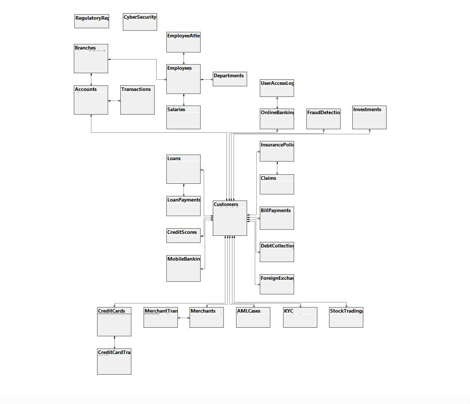

# Banking-Database-System-SQL
Designed a full-scale Banking Database in SSMS with 30+ tables and 10k+ records. This project features a robust ER diagram, 3NF normalization, and modules for fraud detection and cybersecurity. I developed advanced T-SQL queries to track financial KPIs and transaction volumes, transforming complex data into actionable business insights.

# Banking Database System (SQL)

## Project Overview
A full-scale relational database designed to simulate a modern banking ecosystem. This project focuses on data architecture, financial security, and analytical reporting.

## Key Features
* **30+ Interconnected Tables:** Covering Customers, Accounts, Transactions, Loans, and Cybersecurity incidents.
* **10,000+ Records:** Synthetically generated data to simulate real-world workloads.
* **Financial KPIs:** Advanced queries to track liquidity, customer activity, and fraud patterns.
* **Data Integrity:** Strict use of Primary/Foreign keys and Normalization.

## Technologies Used
* **Database Engine:** SQL Server (SSMS)
* **Language:** T-SQL

## Database Schema

## How to Run
1. Execute `01_Schema_Setup.sql` to build the architecture.
2. Run `02_Data_Insertion.sql` to populate the records.
3. Use `03_Analysis_Queries.sql` to view KPIs and insights.
